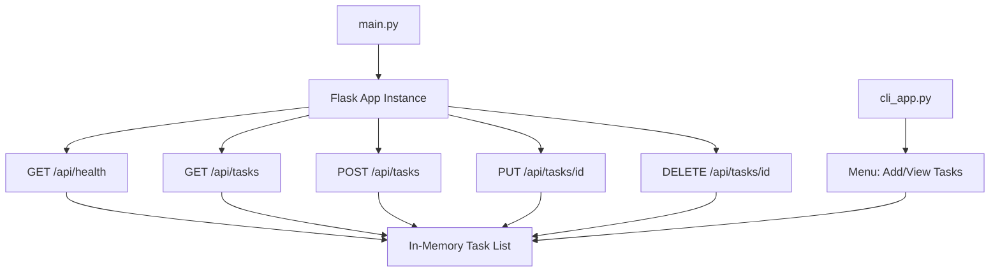

# Architecture Diagram

## Sprint 1 Monolithic

> [!TIP]
> This CLI interface is intentionally simple in Sprint 1. It supports only adding and viewing tasks and shares the in-memory store with the API. In Sprint 2, the CLI will be extended slightly to reflect new features (US005 – Delete, US006 – Mark Complete) but will remain procedural. Full CLI feature parity is deferred to the Web UI in Sprint 4.

