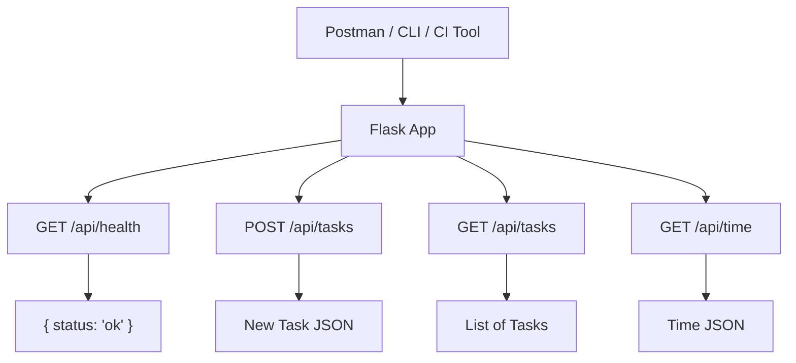

# API Reference Update - Sprint 1

This document provides an overview of the API endpoints planned and/or implemented for each Sprint. While implementation may still be in progress, these specifications serve as a guide for developers and a contract for testers to begin validating expected behavior.

---

## 📘 Overview

**Sprint Goal:** Establish project scaffolding and implement a health check endpoint to confirm the server is up and responding.
**Authentication:** Not required.
**Versioning:** Not required at this stage.
**Environment:** Local development only (e.g., [http://localhost:5000](http://localhost:5000))
**Base Route:** `/api`

>[!NOTE] Sprint 1 includes a CLI-based user interface (`cli_app.py`) for manually interacting with the task system via terminal input. Although it does not define HTTP endpoints, it shares the same underlying task store and supports basic "add/view" functionality.

---

## US001 - Endpoint: Health Check

| Field            | Description                         |
| ---------------- | ----------------------------------- |
| **Method**       | GET                                 |
| **URL**          | `/api/health`                       |
| **Description**  | Verifies that the API is online     |
| **Parameters**   | None                                |
| **Request Body** | None                                |
| **Response**     | `{ "status": "ok" }`                |
| **Status Code**  | `200 OK`                            |
| **Error Codes**  | None                                |
| **Expected Use** | Used by developers, CI, and testers |

### 📎 Example Request (Postman) - Health Check

* Method: GET
* URL: `http://localhost:5000/api/health`
* Send request → Expect: `{ "status": "ok" }`

### 🔍 Related Test Case - Health Check

* **TC-US001-001:** The `/api/health` endpoint should return a `200 OK` with `{"status": "ok"}`.

---

## US002 - Endpoint: Add Task

| Field            | Description                                                 |
| ---------------- | ----------------------------------------------------------- |
| **Method**       | POST                                                        |
| **URL**          | `/api/tasks`                                                |
| **Description**  | Creates a new task                                          |
| **Parameters**   | None                                                        |
| **Request Body** | `{ "title": "Buy groceries" }`                              |
| **Response**     | `{ "id": 1, "title": "Buy groceries", "completed": false }` |
| **Status Code**  | `201 Created`                                               |
| **Error Codes**  | **Error Codes**: `400 Bad Request` – if the `title` field is missing or an empty string    |
| **Expected Use** | Called when a user submits a new task                       |

### 📎 Example Request (Postman) - Add Task

* Method: POST
* URL: `http://localhost:5000/api/tasks`
* Body: `{"title": "Buy groceries"}` (raw JSON)
* Expect: 201 Created and returned task object

### 🔍 Related Test Case - Add Task

* **TC-US002-001:** Should return 201 with valid task
* **TC-US002-002:** Should return 400 for empty title

---

## US003 - Endpoint: View Tasks

| Field            | Description                     |
| ---------------- | ------------------------------- |
| **Method**       | GET                             |
| **URL**          | `/api/tasks`                    |
| **Description**  | Retrieves a list of all tasks   |
| **Parameters**   | None                            |
| **Request Body** | None                            |
| **Response**     | List of task objects            |
| **Status Code**  | `200 OK`                        |
| **Expected Use** | Display all current tasks in UI |

### 📎 Example Request (Postman)

* Method: GET
* URL: `http://localhost:5000/api/tasks`
* Expect: 200 OK and response body:
    ```json
    [
    { "id": 1, "title": "Buy groceries", "completed": false },
    { "id": 2, "title": "Read book", "completed": false }
    ]
    ```

### 🔍 Related Test Case - View Task

* **TC-US003-001:** Should return list of tasks

---

## 🧩 CI Integration Notes

* Add test files for each route: `tests/test_health.py`, `tests/test_tasks.py`
* Include these tests in your GitHub Actions workflow:

```yaml
- name: Run tests
  run: pytest tests/
```

* Configure `app.config['TESTING'] = True` inside your `create_app()`
* These tests ensure the server is running and functionality is correct before merging

---

## 🗺️ System Diagram (Sprint 1)



> This diagram will evolve each sprint to include additional endpoints (e.g. complete, delete).

---

## 🔧 Notes for Developers

* Define routes in `main.py` (Sprint 1 structure)
* Store tasks in an in-memory Python list
* Return proper status codes and JSON errors using Flask
* Include coverage for all edge cases (missing/empty titles)

## 🔬 Notes for Testers

* Implement TDD: write failing tests before writing the feature
* Use Postman and pytest to validate endpoints
* Test for valid inputs and error scenarios (empty title, missing JSON)

---

## 📌 Summary

This API documentation outlines the expected behavior for Sprint 1's foundational endpoints. It defines the contract that ensures the backend is accessible, testable, and ready for Sprint 2 expansion.

* `/api/health` confirms the server is live
* `/api/tasks [POST]` adds tasks with validation
* `/api/tasks [GET]` returns a full task list

> Future endpoints (e.g., update, delete) will follow in Sprints 2 and 3
> 📘 In Sprint 2, we will modularize the API into Blueprints and split tests by route. This document will be revised accordingly.

