# Sprint 1 Planning

This sprint introduces the foundational components of the TaskTracker project. Students will work individually to scaffold the application, implement basic endpoints, and apply testing principles using `pytest` and GitHub Actions CI.

## 1. Sprint Goals

* Set up the project environment and development workflow.
* Implement and test core API endpoints using TDD.
  * Health check route (`/api/`).
  * Add a task (`POST /api/tasks`).
* Establish continuous integration with GitHub Actions.
* Begin API Documentation
* Add a **CLI stub** to support task creation from the command line.
* Introduce manual testing with curl and Postman.
  

## 2. User Stories in Scope

Each user story includes a status, priority, associated GitHub pull request, and detailed acceptance criteria. See `user_stories.md` for full details and checklists.

* **US000** – Initial Setup & Validation
* **US001** – Health Check Endpoint (with GitHub Actions)
* **US002** – Add Task (with validation) via API
* **US003** – View Tasks (List)
* **US004** - Add Task via CLI (Stub)

## 3. Test Planning Overview (see `test_plan.md` for details)

### Automated Testing Strategy

* **TDD:** All endpoints will be implemented using test-driven development.
* **Test Framework:** `pytest`
* **Test Types:** Unit tests for API endpoints and validation logic.
* **Coverage:** Track coverage using `pytest-cov` and enforce through CI.
* **CI:** All tests must pass via GitHub Actions before merging to `main`.

### Manual Testing Strategy (Learning Opportunity)

While this project follows a Test-Driven Development (TDD) approach, manual testing will still play an important educational role in specific contexts.

Automated testing is prioritized, but manual testing will be introduced:
- When automation is not yet feasible (e.g., early UI development)
- When exploring new features during labs
- To help you appreciate the advantages of automated testing through comparison

You may be required to perform manual testing during Sprint Labs or for verifying edge cases that aren’t yet covered by automated tests.

Manual testing tools include:

| Tool                | Purpose                                  | When Used                                |
|---------------------|------------------------------------------|-------------------------------------------|
| `curl`              | Quick terminal-based API testing         | Early development, lightweight checks     |
| `Invoke-RestMethod` | PowerShell-native API testing            | Windows environments, JSON parsing        |
| **Postman**         | GUI-based manual API testing with collections | Exploratory testing, team sharing     |
| **CLI UI**          | Menu-driven interaction with app features | Early-stage logic checks before web UI    |
| **Web UI (manual)** | Browser-based interaction and visual verification | Before Selenium/Playwright automation |

Manual testing results should be captured and submitted as part of your sprint documentation:

- 📸 **Screenshots** of CLI, PowerShell, `curl`, or Postman results
- 📁 **Saved Postman collections** stored in `/tests/postman/`
- ✅ **Checklists or notes** confirming CLI and Web UI functionality

## 4. Tools and Technologies

* `Flask` for backend API
* `pytest` and `pytest-cov` for test and coverage
* Manual Testing Tools: Postman (web), `curl`(bash) and `Invoke-TestMethod` (powershell)
* Python built-in input() and file I/O
* `GitHub Actions` for CI
* `JSON` in-memory store (to be refactored in later sprints)

## 5. Technical Design & Architecture

We will build a simple Flask-based API, supported by a command-line interface (CLI) for early manual interaction. Key design points:

* **Project Structure:** Flat, single-module design in the `app/` directory to start; modularization (Blueprints, classes, services) introduced in later sprints.
* **Routing:** Flask API routes are initially defined in `main.py`; these will be refactored into Blueprints as complexity increases.
* **In-Memory Storage:** Tasks are stored in a Python list during runtime. JSON file and database persistence will be added in later sprints.
* **CLI UI:** A `cli_app.py` interface allows users to manually interact with core features via terminal (e.g., add/view tasks) — useful for manual testing and early validation of logic before the Web UI is built.
* **Test Structure:** All tests are stored in `tests/` and written using `pytest`. CLI logic will be covered where applicable.
* **CI/CD:** GitHub Actions will automatically run tests on push/pull to the `main` branch (`.github/workflows/`).
* **Design Pattern:** Code will evolve from minimalist procedural structure to a modular, object-oriented architecture in future sprints.
* **Input Validation:** Server-side validation will be implemented for required fields (e.g., task `title` must not be empty).

## 6. API Endpoints

```mermaid
flowchart TD
    A["Postman / Browser / CI Tool"] --> B["Flask App (main.py)"]
    
    %% ===== API Endpoints =====
    B --> C1["GET /api/health"]
    B --> C2["POST /api/tasks"]
    B --> C3["GET /api/tasks"]

    %% ===== Responses =====
    C1 --> R1["200 → { status: 'ok' }"]
    C2 --> R2["201 → New Task JSON • 400 if title missing/empty"]
    C3 --> R3["200 → List of Task JSON Objects"]

    %% ===== Data Layer (Sprint 1) =====
    B --> MEM["`In-Memory Python\List Tasks`"]
```

## 7. Key Tasks (linked to GitHub Issues)

* Initialize repository, Python virtual environment, install dependencies
* Create `GET /api/health` and write unit test
* Create `POST /api/tasks`, validate title, write test cases
* Create `GET /api/tasks` endpoint and test
* Implement basic CLI UI (add/view tasks) to interact with task logic manually
* Set up GitHub Actions workflow to run tests on push
* Review coverage report and commit only if passing threshold met

## 8. Risk Management

Identify and mitigate potential risks:

* **CI Configuration Risk**  
  The GitHub Actions workflow may be misconfigured, causing test failures or skipped steps.  
  *Mitigation:* Test the CI workflow early with a basic health check; pin Python and dependency versions.

* **Environment Setup Risk**  
  Team members may face issues setting up the Python/Flask environment.  
  *Mitigation:* Provide detailed setup instructions in `README.md`, supply a working `requirements.txt`, and consider including a `setup.sh` or `.bat` script.

* **TDD Inexperience**  
  The team is new to TDD and `pytest`, which may slow early development.  
  *Mitigation:* Use pair programming, code review checklists, and instructor-provided test case examples.

* **Manual Testing Misuse**  
  Students may rely too heavily on manual testing via CLI or Postman instead of writing automated tests.  
  *Mitigation:* Emphasize that manual testing is for validation and exploration only; require test coverage targets and CI test enforcement.

* **Scope Creep Risk**  
  Attempting to implement features beyond the current sprint (e.g., adding UI features or advanced database logic early).  
  *Mitigation:* Stick to assigned user stories; review scope weekly and hold team members accountable during standups.

* **Merge Conflicts**  
  Multiple developers editing the same file or not coordinating on features may lead to lost work or broken builds.  
  *Mitigation:* Use short-lived branches, frequent syncs (`git pull`), and mandatory PR reviews before merging.

## 9. Documentation Plan

* **README** (`README.md`): Update with project overview, setup instructions, how to run the application locally, and how to execute the test suite. Ensure clarity for new contributors or users.
* **API Documentation** (`docs/api_documentation/`): Describe all available API endpoints, including method, URL, parameters, request/response format, and examples. Should be kept up to date with current functionality.
* **Code Comments**: Write docstrings for all public classes, methods, and functions. Add inline comments for complex or non-obvious logic to improve maintainability.
* **Test Plan** (`docs/s1_test_plan.md`): Outline the overall testing strategy for the sprint, including tools, types of tests (unit, integration, UI), coverage goals, and CI usage. 
* **Test Cases** (`docs/s1_test_cases.md`): Define detailed test cases for each user story, including ID, description, steps, expected result, and test status.
* **Sprint Report**: After sprint completion, summarize what was accomplished, what remains open, challenges faced, and improvements for the next sprint.

## 10. Collaboration & Communication

* Use a **GitHub Project Board** (or Kanban board) to track tasks and story progress (columns:Backlog, In Progress, In Review, Done).
* Create GitHub **Issues** for tasks/bugs and link them to user stories or sprint goals.
* Hold standup meetings (or quick sync-ups) to discuss progress and blockers. (optional for individual project)
* Use **GitHub Pull Requests** for all code merges. (optional, at least one peer review before merging).
* Communicate via team channel (Teams) for quick questions/updates.
* Make frequent commits and push to feature branches so that CI can test integrations early.

## Sprint 1 – Acceptance Criteria

This Sprint includes foundational work on the TaskTracker project including environment setup, testing pipelines, initial API endpoints, and a CLI stub interface. Completion of Sprint 1 requires all the following criteria to be met.

### 🎯 Sprint-Level Completion Criteria (see `s2_sprint_plan`)
  - [ ] All selected user stories (US000–US004) are completed and marked “Done”
  - [ ] Continuous Integration (CI) via GitHub Actions runs on every push and passes for all merged branches
  - [ ] Test coverage reports are generated using `pytest-cov` and meet or exceed the minimum threshold (e.g. ≥ 90%)
  - [ ] A test plan and detailed test cases for each user story are created and committed in `docs/`
  - [ ] Initial API documentation exists and includes all endpoints implemented in Sprint 1 (`docs/api_documentation.md`)
  - [ ] Manual testing results (CLI UI, curl, Postman) are captured with screenshots and/or saved Postman collections in `/tests/postman/`
  - [ ] A working CLI UI stub (`cli_app.py`) is implemented that supports US004:
      - Prompt for task title and description
      - Add to in-memory task list
      - Display confirmation message
  - [ ] The project `README.md` includes instructions for environment setup, CLI usage, API usage, and testing
  - [ ] No open bugs, regressions, or critical issues remain from Sprint 1 deliverables

### 📌 Tracked User Stories
- [ ] #US000 – Initial Setup & Validation
- [ ] #US001 – Health Check Endpoint (with GitHub Actions)
- [ ] #US002 – Add Task (with validation)
- [ ] #US003 – View Tasks (List)
- [ ] #US004 - CLI UI

Each user story is tracked as a sub-issue. Each sub-issue will also have its own acceptance criteria and sub-issues for technical implementation and testing tasks.

### 📂 Organizational Expectations
- [ ] All GitHub Issues for this sprint are linked to this parent Sprint 1 issue.
- [ ] All user stories are assigned to the `Sprint 1` milestone.
- [ ] Each user story includes acceptance criteria and sub-tasks.
- [ ] Each PR includes references to the user story and passes review.
- [ ] The project board reflects accurate status for all work (e.g., moved to `Done`).

### 📄 Required Documentation Artifacts
- [ ] `README.md` – updated project overview and usage
- [ ] `docs/api_documentation.md` – initial API reference
- [ ] `docs/s1_test_plan.md` – Sprint 1 testing strategy
- [ ] `docs/s1_test_cases.md` – Detailed test cases aligned to acceptance criteria
- [ ] Sprint 1 Summary (added to Sprint Report or final comment in this issue)

## 10. Definition of Done (DoD) Checklist – Applies to Each User Story or Task

Each individual story or task is only considered “Done” if all the following conditions are met:

- [ ] All acceptance criteria for the story are met
- [ ] Unit tests are written and passing (TDD)
- [ ] Code coverage meets or exceeds target threshold (e.g., 90%)
- [ ] Code is peer-reviewed and merged to `main` via pull request
- [ ] CI passes on GitHub Actions (test + coverage workflow)
- [ ] Documentation is updated if needed (README, API docs, CLI usage)
- [ ] Manual testing evidence is provided (screenshots, CLI/demo output, Postman collection) if applicable
- [ ] No critical bugs or open defects remain for this story
