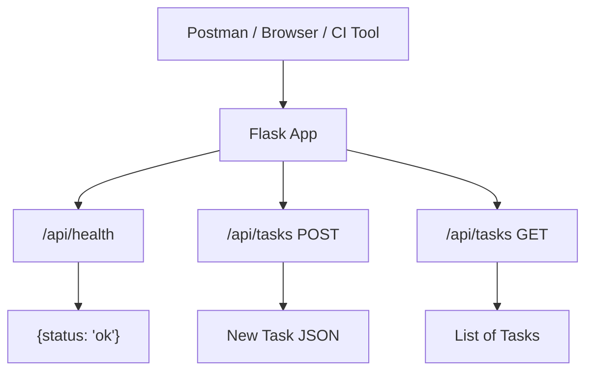
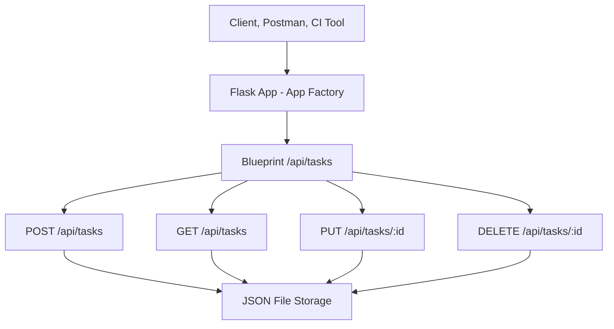

# API Reference Update - Sprint 2

This document provides an overview of the API endpoints planned and/or implemented for each Sprint. While implementation may still be in progress, these specifications serve as a guide for developers and a contract for testers to begin validating expected behavior.

## 📘 Overview

**Sprint Goal:** Refactor code for modularity, introduce JSON file persistence, and implement new functionality for marking and deleting tasks.
**Authentication:** Not required.
**Versioning:** Not required at this stage.
**Environment:** Local development only (e.g., [http://localhost:5000](http://localhost:5000))
**Base Route:** `/api`
**Major Enhancements:**

* Blueprint modularization of routes
* App factory pattern
* JSON-based persistence using `data/tasks.json`

>[!NOTE] Sprint 1 included a CLI-based user interface (`cli_app.py`) for manually interacting with the task system via terminal input. Although it does not define HTTP endpoints, it shares the same underlying task store and supports basic "add/view" functionality.

---
## US001 - Endpoint: Health Check

| Field            | Description                         |
| ---------------- | ----------------------------------- |
| **Method**       | GET                                 |
| **URL**          | `/api/health`                       |
| **Description**  | Verifies that the API is online     |
| **Parameters**   | None                                |
| **Request Body** | None                                |
| **Response**     | `{ "status": "ok" }`                |
| **Status Code**  | `200 OK`                            |
| **Error Codes**  | None                                |
| **Expected Use** | Used by developers, CI, and testers |

### 📎 Example Request (Postman) - Health Check

* Method: GET
* URL: `http://localhost:5000/api/health`
* Send request → Expect: `{ "status": "ok" }`

### 🔍 Related Test Case - Health Check

* **TC-US001-001:** The `/api/health` endpoint should return a `200 OK` with `{"status": "ok"}`.

---

## US002 - Endpoint: Add Task

| Field            | Description                                                 |
| ---------------- | ----------------------------------------------------------- |
| **Method**       | POST                                                        |
| **URL**          | `/api/tasks`                                                |
| **Description**  | Creates a new task                                          |
| **Parameters**   | None                                                        |
| **Request Body** | `{ "title": "Buy groceries" }`                              |
| **Response**     | `{ "id": 1, "title": "Buy groceries", "completed": false }` |
| **Status Code**  | `201 Created`                                               |
| **Error Codes**  | **Error Codes**: `400 Bad Request` – if the `title` field is missing or an empty string    |
| **Expected Use** | Called when a user submits a new task                       |

### ✅ Valid Request Body
```json
{
  "title": "Buy groceries",
  "description": "Pick up eggs and milk"
}
```

### ❌ Invalid Request Examples

- **Missing title:**
```json
{
  "description": "Forgot the title"
}
```
- **Empty title:**
```json
{
  "title": "",
  "description": "Empty title string"
}
```
>[!NOTE: Test Case Needs to be Created and Code Modified]
- **Whitespace-only title:**
```json
{
  "title": "   ",
  "description": "Whitespace only"
}
```

### ✅ Success Response (201 Created)
```json
{
  "id": 1,
  "title": "Buy groceries",
  "description": "Pick up eggs and milk"
}
```

### ❌ Error Response (400 Bad Request)
```json
{
  "error": "Title is required"
}
```

---

### 📎 Example Request (Postman) - Add Task

* Method: POST
* URL: `http://localhost:5000/api/tasks`
* Body: `{"title": "Buy groceries"}` (raw JSON)
* Expect: 201 Created and returned task object

### 🔍 Related Test Case - Add Task

* **TC-US002-001:** Should return 201 with valid task
* **TC-US002-002:** Should return 400 for empty title

---

## US003 - Endpoint: View Tasks

| Field            | Description                     |
| ---------------- | ------------------------------- |
| **Method**       | GET                             |
| **URL**          | `/api/tasks`                    |
| **Description**  | Retrieves a list of all tasks   |
| **Parameters**   | None                            |
| **Request Body** | None                            |
| **Response**     | List of task objects            |
| **Status Code**  | `200 OK`                        |
| **Expected Use** | Display all current tasks in UI |

### ✅ Response (200 OK)

**Empty List Example:**
```json
[]
```

**Populated List Example:**
```json
[
  {
    "id": 1,
    "title": "Buy groceries",
    "description": "Pick up eggs and milk"
  }
]
```

### 📎 Example Request (Postman)

* Method: GET
* URL: `http://localhost:5000/api/tasks`
* Expect: 200 OK and response body:
    ```json
    [
    { "id": 1, "title": "Buy groceries", "completed": false },
    { "id": 2, "title": "Read book", "completed": false }
    ]
    ```

### 🔍 Related Test Case - View Task

* **TC-US003-001:** Should return list of tasks

---

##  US004 - Endpoint: Mark Task Complete

| Field            | Description                                                |
| ---------------- | ---------------------------------------------------------- |
| **Method**       | PUT                                                        |
| **URL**          | `/api/tasks/<id>`                                          |
| **Description**  | Marks a task as complete based on its ID.                  |
| **Parameters**   | `<id>` path parameter, task ID (integer)                   |
| **Request Body** | Not Required                                               |
| **Response**     | JSON object representing the updated task                  |
| **Status Code**  | `200 OK` if task is found and updated                      |
|                  | `404 Not Found` if task ID does not exist                  |
| **Expected Use** | Used when a user marks a task as complete                  |

**Example Response:**

```json
{
  "id": 1,
  "title": "Buy milk",
  "completed": true
}
```

###  Example Request (Postman)

* Method: PUT
* URL: `http://localhost:5000/api/tasks/1`
* Expect: 200 OK and updated task

###  Related Test Cases

* **TC-US004-001:** Mark task complete successfully
* **TC-US004-002:** Invalid task ID returns 404
* **Related User Story:** US004 – Mark Task Complete
* **Related User Story:** US005 – Delete Task


---

## US005 - Endpoint: Delete Task

| Field            | Description                              |
| ---------------- | ---------------------------------------- |
| **Method**       | DELETE                                   |
| **URL**          | `/api/tasks/<id>`                        |
| **Description**  | Deletes a task with the specified ID.                     |
| **Parameters**   | `<id>` path parameter, task ID (integer) |
| **Request Body** | Not Required                                     |
| **Response**     | No content                               |
| **Status Code**  | `204 No Content`                         |
|                  | `404 Not Found` for invalid ID           |
| **Expected Use** | Removes a task from the system           |

###  Example Request (Postman)

* Method: DELETE
* URL: `http://localhost:5000/api/tasks/1`
* Expect: 204 No Content

###  Related Test Cases

* **TC-US005-001:** Task deleted successfully
* **TC-US005-002:** Invalid task ID returns 404

---

##  US011 - System Behavior: JSON Persistence

| Behavior             | Description                                      |
| -------------------- | ------------------------------------------------ |
| **File Path**        | `app/data/tasks.json`                            |
| **Write**            | Task changes saved after every add/update/delete |
| **Read**             | Tasks loaded at app startup                      |
| **Failure Handling** | Gracefully handles missing/invalid JSON          |

###  Related Test Case

* **TC-US011-001:** Validate persistence to `tasks.json`
* **Related User Story:** US011 – Persist Tasks to File

---

##  Notes on Refactor

* Routes are now organized in `routes/tasks.py` using Flask Blueprint
* The app is initialized using `create_app()` in `app/__init__.py`
* The `main.py` file only starts the app using `app = create_app()`
* Tasks are no longer stored in memory but in a shared JSON file

---
##  Notes on Sprint 2 Refactor

* Routes are now organized in `routes/tasks.py` using Flask Blueprint
* The app is initialized using `create_app()` in `app/__init__.py`
* The `main.py` file only starts the app using `app = create_app()`
* Tasks are no longer stored in memory but in a shared JSON file

---

##  CI Integration Notes

* Add test files for each route: 
  * `tests/test_health.py`
  * `tests/test_tasks.py`
  * `tests/test_complete_task.py`
  * `tests/test_delete_task.py`
  * `tests/test_task_storage.py`
  
* >  Testers: Capture and submit a screenshot of the coverage report after running `pytest` to confirm ≥90% coverage.

* Update GitHub Actions config to include new tests and enforce coverage

```yaml
- name: Run tests
  run: pytest tests/ --cov=app --cov-report=term-missing
```

---

## 🗺️ System Diagram (Sprint 1)



> This diagram will evolve each sprint to include additional endpoints (e.g. complete, delete).


## System Diagram (Sprint 2)



> This expanded system diagram shows routing via Blueprint and the introduction of file persistence.

---

## 🔧 Notes for Developers

* Define routes in `main.py` (Sprint 1 structure)
* Store tasks in an in-memory Python list
* Return proper status codes and JSON errors using Flask
* Include coverage for all edge cases (missing/empty titles)
* Implement data access in a `utils.py` or service module
* Abstract file I/O using helper functions
* Refactor route logic for clarity and single responsibility
* Ensure route IDs match integer keys in stored tasks

## 🔬 Notes for Testers

* Implement TDD: write failing tests before writing the feature
* Use Postman and pytest to validate endpoints
* Test for valid inputs and error scenarios (empty title, missing JSON)
* Use Postman to manually verify PUT and DELETE behavior
* Test with valid and invalid task IDs
* Use `pytest` to validate persistence and route behaviors
* Confirm `tasks.json` contents match expected state after requests

---

## 📌 Summary

This API documentation outlines:
* Expected behavior for Sprint 1's foundational endpoints
    * `/api/health` confirms the server is live
    * `/api/tasks [POST]` adds tasks with validation
    * `/api/tasks [GET]` returns a full task list
* Defines new Sprint 2 endpoints and architecture changes. It builds on Sprint 1’s work by making the app persistent, modular, and more realistic in its handling of data and features.

Next Sprint: Add automated API testing (e.g. `requests`), OOP refactors, and enhanced test suites.
