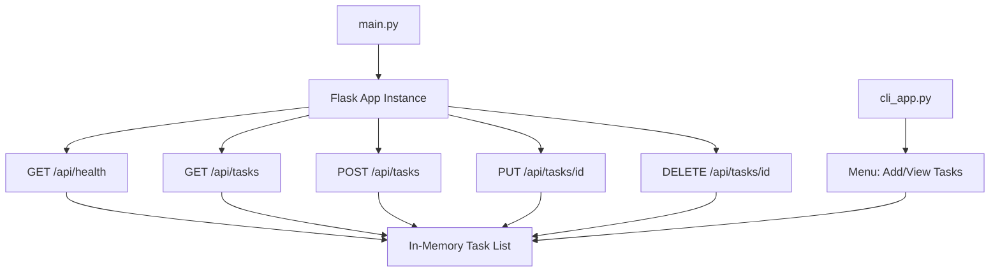
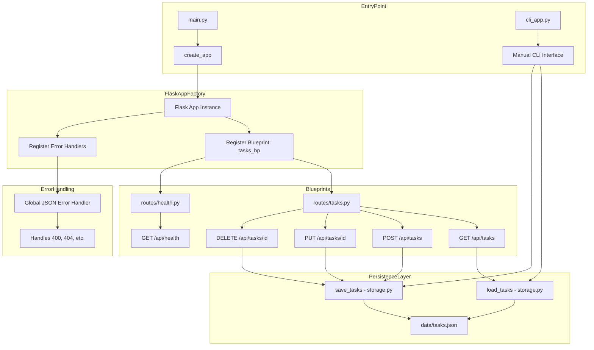

# Architecture Diagram

## Sprint 1 Monolithic

>[!NOTE] In Sprint 1, a basic CLI UI (`cli_app.py`) is introduced to simulate manual task interaction. It allows adding and viewing tasks via terminal input. This CLI is connected to the same in-memory task list as the Flask API and is used for early manual testing (US004).

> [!TIP]
> This CLI interface is intentionally simple in Sprint 1. It supports only adding and viewing tasks and shares the in-memory store with the API. In Sprint 2, the CLI will be extended slightly to reflect new features (US005 – Delete, US006 – Mark Complete) but will remain procedural. Full CLI feature parity is deferred to the Web UI in Sprint 4.

# Sprint 2

