# Sprint 2 Planning

Sprint 2 focuses on enhancing TaskTracker by introducing key backend features and improving architecture as well as implements new features. 

* `RF001`: Refactors the codebase using Flask Blueprints for modular structure
* `RF002`: Refactors JSON storage to be persistent 
* `US005`, `US007`, and `US011`: Adds new task operations (mark complete, delete, persist to file)
* `US015`: Introduces a unified error handling system using Flask’s @errorhandler `US015`
* `RF003`: Refactors the Test Structure into subfolders that match the app’s modular design
    * Create `pytest.ini`    # Configures pytest (e.g., testpaths, markers)
    * Create `conftest.py`  # Shared fixtures and parameterization for tests
* Refactors CLI to use shared JSON persistence layer (`load_tasks()` and `save_tasks()`) so API and CLI work from the same task data
* Testing
  * Use `pytest` locally and on CI to verify all implementations match the user stories and test cases.
  * Manually Test APIs Using `curl`, `Invoke-RestMethod`, and `Postman`

## 1. Sprint Goals

* 🔁 Refactor (RF001): Modularize routing using Flask Blueprints for separation of concerns (Refactor).
* 🔁 Refactor: (RF002): Replace in-memory task list with file-based persistence.
* 🔁 Refactor: (RF003): Restructure tests into subfolders that match the app’s modular design
* ✅ US005 – Mark Task Complete: Implement PUT /api/tasks/<id> to update task status.
* ✅ US007 – Remove Task: Implement DELETE /api/tasks/<id> to delete a task.
* ✅ US011 – Persist Tasks: Save and load tasks using a JSON file (data/tasks.json).
* ✅ US006 (CLI UI): While the full CLI will not be completed until Sprint 3, this sprint lays the foundation by using the same `load_tasks()` and `save_tasks()` functions created in RF002. This allows the CLI and API to share persistent data across runs.
* ✅ US015 – API Error Handling: Add global error handling using @app.errorhandler, returning consistent JSON errors.
* ✅ Manual Testing: Use Postman to validate endpoints manually and export collections.
* ✅ Docs: Update docs/api_documentation.md and README.md to reflect new endpoints and behavior.

🔍 Notes:
* US006 (CLI UI Full Implementation) is not yet in scope for Sprint 2, but the JSON persistence from US011 lays the groundwork for expanded CLI testing in Sprint 3.

* US014 (Add UI for Task Creation) and US018 (View Task List) will come into scope when we transition to the web frontend, likely Sprint 4.

## 2. In Scope

Each user story includes a status, priority, associated GitHub pull request, and detailed acceptance criteria. See `docs/user_stories.md` for full details and checklists.

### Architecture Refactors in Scope


* **RF001** - Refactor to Flask Blueprint (routes/tasks.py)
* **RF002** – Refactor backend to replace the in-memory list with file-based storage. (Used by Both API and CLI)
  * This refactor will replace the in-memory list (`tasks = []`) with persistent storage using a JSON file (`data/tasks.json`).
  * Two shared functions will be implemented:
    * `load_tasks()` – Reads tasks from the file.
    * `save_tasks()` – Writes tasks to the file.
  * This is an example of **shared persistence logic**. It ensures that both the Flask API and the CLI interface operate on the same underlying data.
  * **JSON File Storage** is a backend refactor that replaces the in-memory list with file-based storage. It introduces helper functions like load_tasks() and save_tasks() to read/write data/tasks.json. This improves architecture and allows persistence, but does not guarantee it works.
    * US011 – Persist Tasks is a user-facing feature confirming that data actually persists across app restarts. It includes tests that validate tasks survive shutdown and reload.
  * 🧠 It also prepares the codebase for **object-oriented refactoring in Sprint 3**, where this logic will move into a TaskManager class.
* **RF003**- Refactor Tests Structure

### User Stories in Scope

* **US004** – Mark Task Complete
* **US005** – Remove Task
* **US011** – Persist Tasks
* **US015** - API Error Handling

## 🛠️ Development Flow

1. Complete blueprint routes`RF001` and file storage `RF002`
2. Verify all existing tests pass (regression check)
3. Implement User Stories:
   - US004 – Mark Task Complete
   - US005 – Delete Task
   - US011 – Persist Tasks to File
   - US015 – Global Error Handling
- Write new tests and manually verify with `curl`, `Invoke-RestMethod` and `Postman`
- Commit and push with updated documentation and coverage
4. Complete `RF003`

## 3. Test Planning Overview (see docs/testing/test_plan.md for details)

* **Test Approach:** TDD remains core methodology.
* **Tools**
  * `pytest` for automated unit/integration tests.
  * `Postman` for manual API testing.
  * `curl` for manual API testing
  * `Invoke RestMethod` for manual API testing
* **New Testing Focus**
  * Verify 400 Bad Request responses for invalid task data (e.g., missing title).
  * Verify 404 Not Found for operations on nonexistent task IDs.
  * Ensure JSON errors follow a consistent format (e.g., { "error": "Bad Request", "message": "Title is required" })
* **Test Types:** Unit and API-level tests
* **Coverage:** Use pytest-cov to measure and track coverage. Ensure critical logic and error paths are covered.
* **CI:** GitHub Actions will run all tests and enforce coverage thresholds before merges.

## 4. Tools and Technologies

* `Flask` with Blueprint modular structure
* `pytest` + `pytest-cov`
* `GitHub Actions` for CI
* `JSON` file persistence (`app/data/tasks.json`)
* `postman` for API Testing (manual)
* `curl` for API Testing (manual)
* `Invoke RestMethod` for API Testing (manual)

## 5. Technical Design Changes

Architecture evolves from Sprint 1 as follows:

* Route definitions refactored into routes/tasks.py using Blueprints.
* Error handling unified under a custom error handler via @app.errorhandler().
* Modular file structure introduced.
   * **App Factory Pattern:** Use `create_app()` in `app/__init__.py`
   * **Persistence:** Read/write task data to/from `data/tasks.json`
   * **Revise Test Structure:** Split `test_tasks.py` and organize tests by concern:
      - Move tests into subfolders to match application modules:
        - `tests/tasks/` for task-related endpoints (e.g., add, get, update, delete)
        - `tests/health/` for health checks and app factory setup
        - `tests/storage/` for file-based persistence logic
      - This modular test layout improves clarity, simplifies navigation, and aligns with the Blueprint and OOP architecture.
t
  * **Refactor:** `main.py` reduced to app initialization only

### API

```mermaid
flowchart TD
    A[Postman / Browser / CI Tool] --> B["Flask App (create_app)"]
    B --> C0["Blueprint: /api"]

    %% ===== API (JSON) =====
    C0 --> H["GET /api/health"]
    C0 --> TGET["GET /api/tasks"]
    C0 --> TPOST["POST /api/tasks"]
    C0 --> TPUT["PUT /api/tasks/&lt;id&gt; (mark complete)"]
    C0 --> TDEL["DELETE /api/tasks/&lt;id&gt;"]

    %% ===== Responses =====
    H --> RH["200 → { status: 'ok' }"]
    TGET --> RGET["200 → [ Task, ... ]"]
    TPOST --> RPOST["201 → New Task JSON • 400 if title missing/empty/whitespace"]
    TPUT --> RPUT["200 → Updated Task JSON • 404 if not found"]
    TDEL --> RDEL["204 → No Content • 404 if not found"]

    %% ===== Persistence (JSON file) =====
    subgraph Persistence [File Persistence]
      FS["tasks.json (app/data/tasks.json)"]
    end

    %% Reads/Writes
    TGET -- read --> FS
    TPOST -- write --> FS
    TPUT -- write --> FS
    TDEL -- write --> FS
```


## 6. Key Tasks 

* Implementations Tasks:

  * **RF001 – Blueprint Refactor:** Move route definitions into Flask Blueprint module (routes/tasks.py) and update app factory.
    * Implement US004, US005, US011 and US015
      * test PUT /api/tasks/<id> to mark task complete
      * test DELETE /api/tasks/<id> to remove a task
      * test file persistence logic using data/tasks.json
      * global error handler and test for error conditions
    * Use Postman, `curl` and `Invoke RestMethod` to verify JSON format and correct HTTP status codes
    * Maintain CI Workflows
  * **RF002– JSON File Storage:** Refactor all logic to use a common storage module (`app/services/storage.py`). Both the API and CLI now share the same persistent data source (`data/tasks.json`). This enables consistent behavior and decouples business logic from input/output interfaces.  
      * Manually test CLI with:
        ```bash
        python cli/cli_app.py
        ```
    * Update `cli_app.py` to use `load_tasks()` and `save_tasks()` from `services/storage.py`. This allows CLI and API to share task data and prepares for Sprint 3 OOP refactor.
    * This begins the CLI foundation (US006) by enabling it to use persistent task storage. Full CLI menu (US028) will be done in Sprint 3.
  * **RF003 - Test Refactor:** Restructure tests into subfolders that match the app’s modular design:
    - `tests/tasks/` → feature-specific tests (add, delete, complete, get)
    - `tests/health/` → health check and app factory tests
    - `tests/storage/` → persistence and file I/O tests
  * **Docs**
    * Review and update documentation and coverage reports
    * Update API docs to show error structure and new endpoints
    * Maintain CI workflows and validate all tests pass
  
## 7. Risk Management

* **Blueprint Refactor Risk:** Incorrect modularization may break imports. Mitigation: Test routes independently and review app factory setup.
* **Persistence Failures:** File access or data format issues can cause crashes. *Mitigation:* Validate JSON structure and handle I/O exceptions.
* **Test Coverage Drop:** Refactor may temporarily reduce coverage. *Mitigation:* Write coverage-focused tests for new modules and update CI.
* **Error Handler Overlap Risk:** Conflicting error responses from Flask default and custom handler. Mitigation: Register a single unified error format early.
* **Test Gaps Risk:** Postman tests may not be comprehensive. Mitigation: Mirror Postman test cases with automated pytest equivalents.

## 8. Documentation Plan

* Update `README.md` Add notes on new endpoints, modularization changes, and file persistence feature.
* Update `s2_test_plan.md`, `s2_test_cases.md`, and `s2_test_report.md`
* Update API documentation to reflect new endpoints and structure changes
* Create or update architecture diagram to reflect Blueprint pattern and persistence layer

## 9. Collaboration & Communication

* Use GitHub Project Board to manage Sprint 2 tasks
* Create GitHub Issues linked to user stories
* PRs must pass CI and include new tests
* Document major architectural changes in README

## Sprint 2 - Acceptance Criteria

### 📌 Sprint-Level Acceptance Criteria (Product Owner Level)

  The Sprint is considered complete when:

  * [ ] All four user stories (US004, US005, US011, and US015) are complete and marked Done
  * [ ] RF001 - Refactor: Routing logic is moved to `routes/tasks.py` and `routes/health.py` using Flask Blueprints
  * [ ] RF002 - Refactor: Task data is persisted using `services/storage.py` and stored in `data/tasks.json`
  * [ ] RF003 - Refactor: Organize test files into subfolders by concern (`tests/tasks/`, `tests/health/`, `tests/storage/`)  ← (Matches RF003)
  * [ ] Core task actions (add, edit, complete, delete) function with file persistence enabled
  * [ ] `PUT /api/tasks/<id>` correctly marks tasks as completed
  * [ ] `DELETE /api/tasks/<id>` removes tasks from the file and memory
  * [ ] Global error handler returns structured JSON for 400/404/405 errors
  * [ ] API documentation is updated with new endpoints, responses, and examples
  * [ ] Test plan and test cases are updated in `docs/test_documentation/`
  * [ ] Test coverage meets or exceeds 90%
  * [ ] CI workflows pass on all pushes and PRs

    
    ---

  ### ✅ Definition of Done (DoD) (applies to each user story or task)

  * [ ] Pass all acceptance criteria
  * [ ] Include tests for valid input, invalid input, and edge cases
  * [ ] All tests pass locally and in CI (GitHub Actions)
  * [ ] Code coverage threshold met or exceeded (≥ 90%)
  * [ ] Application runs correctly with JSON file persistence
  * [ ] Documentation updated (code comments, API docs, test docs)
  * [ ] API documentation includes examples for new/refactored endpoints
  * [ ] Main branch is deployable with no critical bugs or regressions
  * [ ] Manual Postman collections committed in `tests/postman/`


