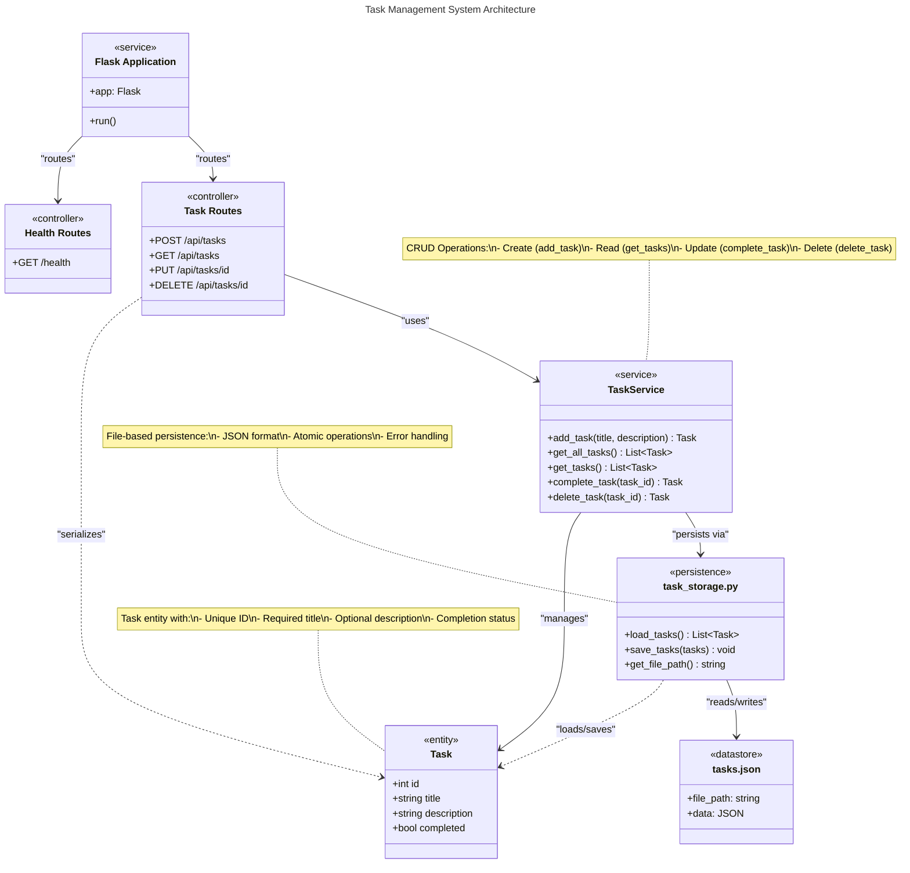

```mermaid
---
title: Task Management System Architecture
---
classDiagram
    %% Flask Application Layer
    class FlaskApp["Flask Application"] {
        <<service>>
        +app: Flask
        +run()
    }
    
    %% Route Layer  
    class TaskRoutes["Task Routes"] {
        <<controller>>
        +POST /api/tasks
        +GET /api/tasks
        +PUT /api/tasks/id
        +DELETE /api/tasks/id
    }
    
    class HealthRoutes["Health Routes"] {
        <<controller>>
        +GET /health
    }
    
    %% Service Layer (Business Logic)
    class TaskService {
        <<service>>
        +add_task(title, description) Task
        +get_all_tasks() List~Task~
        +get_tasks() List~Task~
        +complete_task(task_id) Task
        +delete_task(task_id) Task
    }
    
    %% Storage Layer (Persistence)
    class TaskStorage["task_storage.py"] {
        <<persistence>>
        +load_tasks() List~Task~
        +save_tasks(tasks) void
        +get_file_path() string
    }
    
    %% Data Model
    class Task {
        <<entity>>
        +int id
        +string title
        +string description
        +bool completed
    }
    
    %% File System
    class JSONFile["tasks.json"] {
        <<datastore>>
        +file_path: string
        +data: JSON
    }
    
    %% Relationships
    FlaskApp --> TaskRoutes : "routes"
    FlaskApp --> HealthRoutes : "routes"
    TaskRoutes --> TaskService : "uses"
    TaskService --> TaskStorage : "persists via"
    TaskStorage --> JSONFile : "reads/writes"
    TaskService --> Task : "manages"
    
    %% Dependencies
    TaskRoutes ..> Task : "serializes"
    TaskStorage ..> Task : "loads/saves"
    
    %% Notes
    note for TaskService "CRUD Operations:\n- Create (add_task)\n- Read (get_tasks)\n- Update (complete_task)\n- Delete (delete_task)"
    note for TaskStorage "File-based persistence:\n- JSON format\n- Atomic operations\n- Error handling"
    note for Task "Task entity with:\n- Unique ID\n- Required title\n- Optional description\n- Completion status"
```
