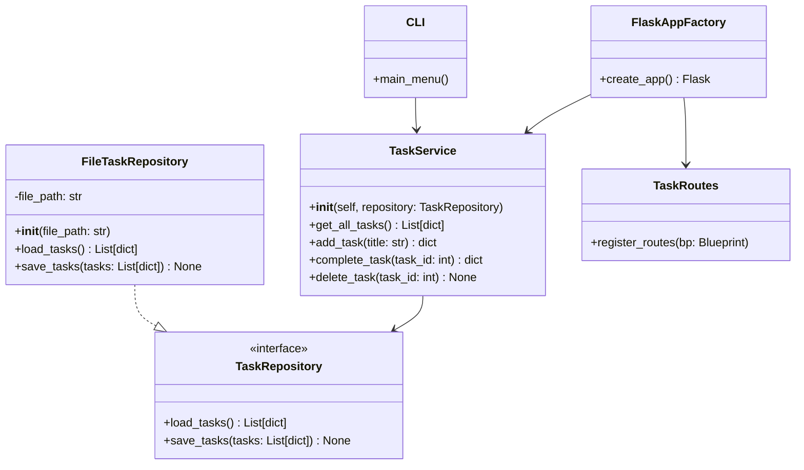

> 📌 This class diagram illustrates the separation of concerns using OOP principles in Sprint 3:
>
> * `TaskService` handles logic.
> * `TaskRepository` is an interface for persistence.
> * `FileTaskRepository` implements JSON file storage.
> * `TaskRoutes` holds Blueprint route logic.
> * `FlaskAppFactory` wires everything together.

You may later extend this by adding a `DatabaseTaskRepository` that also implements `TaskRepository` in Sprint 4.

> 💡 `CLI` is included as a transitional interface. It will be deprecated in Sprint 4 when a Web UI is introduced.
