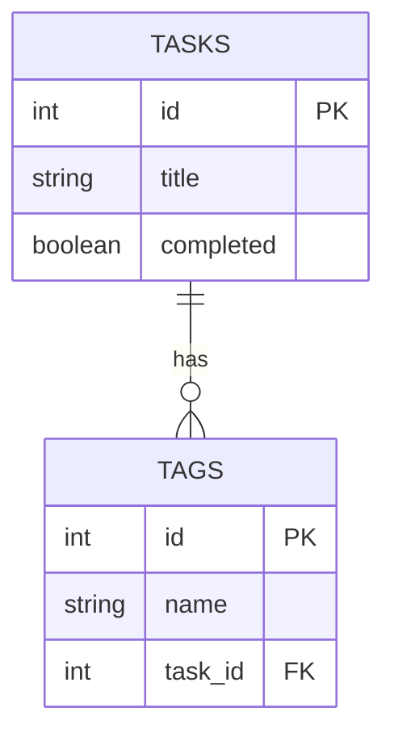

# Task Tracker ERD

> 📌 This ERD defines the core `Task` entity for Sprint 3 and includes an optional `Tag` entity for future extensibility.
>
> In Sprint 3, tasks are stored in JSON files, but this model will guide the schema when migrating to a database in Sprint 4.
>
> * `id`: Unique identifier
> * `title`: Task description (required)
> * `completed`: Boolean flag
> * (Optional) `tags`: A possible extension many-to-one with tasks
>
> 🧠 **Note:** While full database integration will be completed in Sprint 4, this ERD is introduced now in Sprint 3 to help developers and testers understand the future schema. It serves as a planning and alignment tool to ensure the current architecture is designed to support seamless database migration later.
