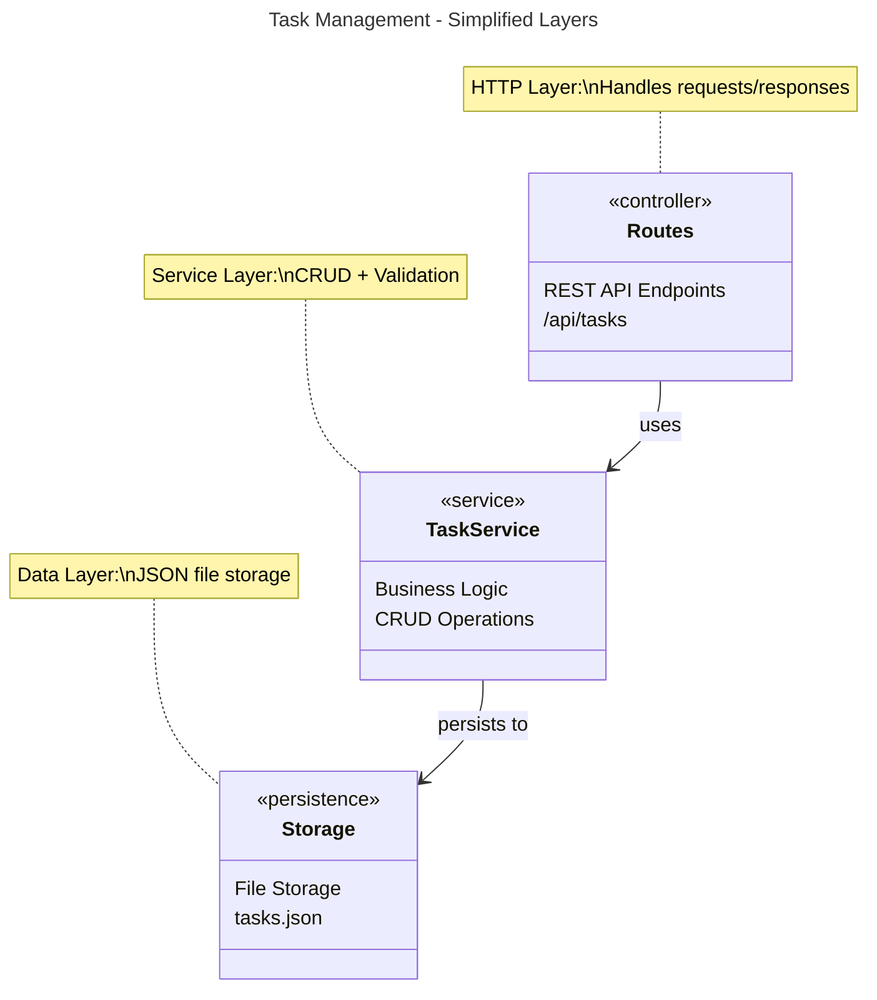
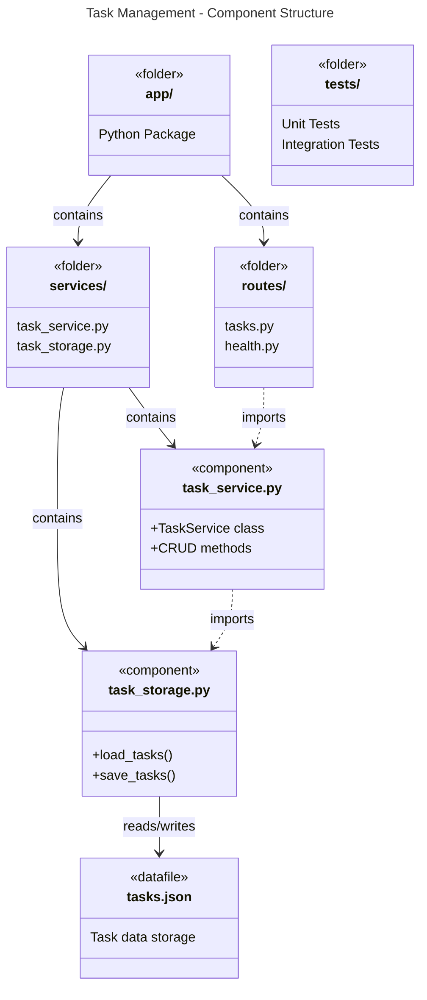

# Task Management System - Simplified Architecture

## Simplified Layered View

```mermaid
---
title: Task Management - Simplified Layers
---
classDiagram
    %% Application Layers
    class Routes {
        <<controller>>
        REST API Endpoints
        /api/tasks
    }
    
    class TaskService {
        <<service>>
        Business Logic
        CRUD Operations
    }
    
    class Storage {
        <<persistence>>
        File Storage
        tasks.json
    }
    
    %% Simple relationships
    Routes --> TaskService : uses
    TaskService --> Storage : persists to
    
    %% Clean annotations
    note for Routes "HTTP Layer:\nHandles requests/responses"
    note for TaskService "Service Layer:\nCRUD + Validation"
    note for Storage "Data Layer:\nJSON file storage"
```

## Component File Structure

```mermaid
---
title: Task Management - Component Structure  
---
classDiagram
    %% File/Folder Components
    class App["app/"] {
        <<folder>>
        Python Package
    }
    
    class Routes["routes/"] {
        <<folder>>
        tasks.py
        health.py
    }
    
    class Services["services/"] {
        <<folder>>
        task_service.py
        task_storage.py
    }
    
    class Tests["tests/"] {
        <<folder>>
        Unit Tests
        Integration Tests
    }
    
    class TaskServiceFile["task_service.py"] {
        <<component>>
        +TaskService class
        +CRUD methods
    }
    
    class TaskStorageFile["task_storage.py"] {
        <<component>>
        +load_tasks()
        +save_tasks()
    }
    
    class TasksJSON["tasks.json"] {
        <<datafile>>
        Task data storage
    }
    
    %% Structure relationships
    App --> Routes : contains
    App --> Services : contains
    Services --> TaskServiceFile : contains
    Services --> TaskStorageFile : contains
    TaskStorageFile --> TasksJSON : reads/writes
    
    %% Dependencies
    TaskServiceFile ..> TaskStorageFile : imports
    Routes ..> TaskServiceFile : imports
```
