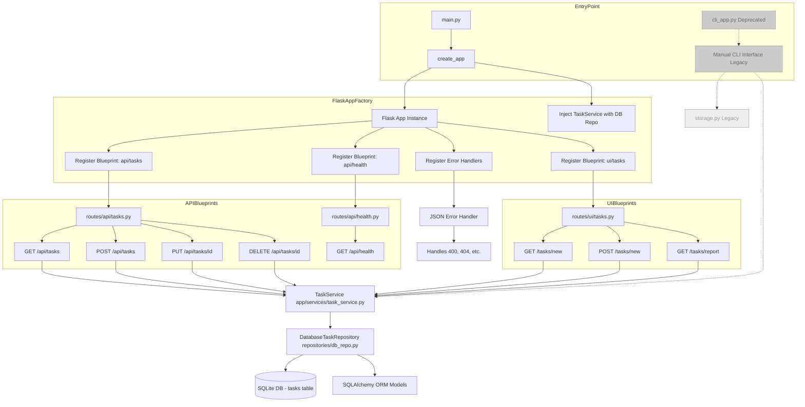

# S4 Architecture 

```mermaid
graph TD

%% ========== Entry Point ==========
subgraph EntryPoint
    A[main.py] --> B[create_app]
    A2[cli_app.py Deprecated] -.-> K[Manual CLI Interface Legacy]
end

%% ========== App Factory ==========
subgraph FlaskAppFactory
    B --> C[Flask App Instance]
    C --> D[Register Blueprint: api/tasks]
    C --> D2[Register Blueprint: ui/tasks]
    C --> Eh[Register Blueprint: api/health]
    C --> E[Register Error Handlers]
    B --> DI[Inject TaskService with DB Repo]
end

%% ========== Blueprints ==========
subgraph APIBlueprints
    D --> F[routes/api/tasks.py]
    F --> F1[GET /api/tasks]
    F --> F2[POST /api/tasks]
    F --> F3[PUT /api/tasks/id]
    F --> F4[DELETE /api/tasks/id]
    Eh --> H1[routes/api/health.py]
    H1 --> H2[GET /api/health]
end

subgraph UIBlueprints
    D2 --> U[routes/ui/tasks.py]
    U --> U1[GET /tasks/new]
    U --> U2[POST /tasks/new]
    U --> U3[GET /tasks/report]
end

%% ========== Service Layer ==========
F1 & F2 & F3 & F4 & U1 & U2 & U3 --> S[TaskService app/services/task_service.py]
S --> R[DatabaseTaskRepository repositories/db_repo.py]

%% ========== Database Layer ==========
R --> DB[(SQLite DB - tasks table)]
R --> ORM[SQLAlchemy ORM Models]

%% ========== Error Handling ==========
E --> J[JSON Error Handler]
J --> J1[Handles 400, 404, etc.]

%% ========== Deprecated (CLI Only) ==========
K -.-> S
K -.-> storage[storage.py Legacy]

style A2 fill:#ccc,stroke:#999,color:#666
style K fill:#ccc,stroke:#999,color:#666
style storage fill:#eee,stroke:#999,color:#999
```