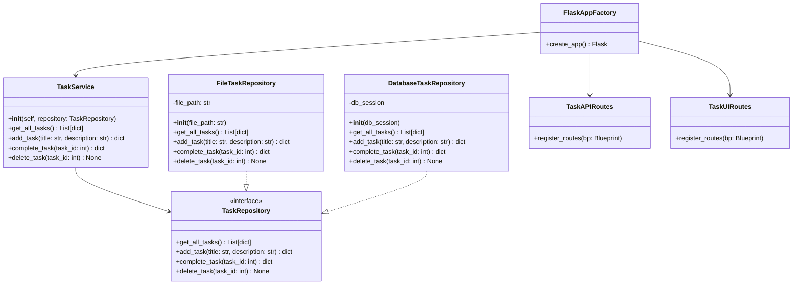

# S4 Class Diagram

> 🧩 **Sprint 4 Architectural Highlights**:
>
> - The system now uses `DatabaseTaskRepository` with SQLAlchemy for persistence.
> - `TaskService` is injected with a `TaskRepository` using **constructor-based DI** via the app factory.
> - `TaskUIRoutes` provides form-based task creation with real-time validation.
> - The CLI is now deprecated and fully replaced by the web UI.

