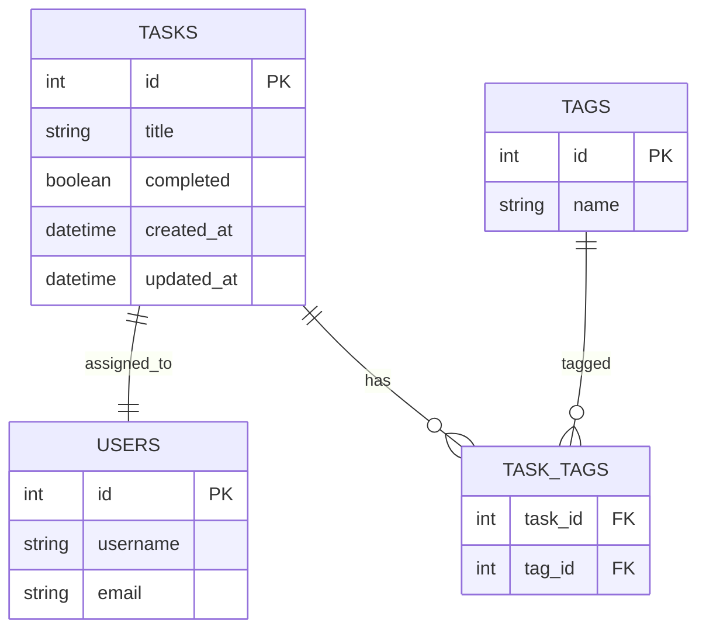

# Sprint 4: Task Tracker ERD

> 🧠 Sprint 4 ERD (Entity Relationship Diagram)
>
> This diagram reflects the database schema implemented using SQLAlchemy during Sprint 4. The in-memory JSON storage has been replaced with a relational database.
>
> Fields:
>
> * `id`: Primary key, auto-incremented
> * `title`: Required task title (string)
> * `completed`: Boolean flag for task status
> * `created_at`: Timestamp for when the task was created
> * `updated_at`: Timestamp for last modification
>
> 📌 Additional entities (e.g., `tags`, `users`) may be introduced in future sprints. This ERD is aligned with the SQLAlchemy model and supports testability and CRUD operations via ORM.
>
> 🔁 This schema replaces the file-based design from Sprint 3 and is persisted via SQLite or PostgreSQL.
