# 🏗️ Sprint 4 – Web UI, Database Integration, and Acceptance Testing

## 🎯 Sprint Goal

This sprint transitions the TaskTracker project from file-based persistence to a SQL database using SQLite with SQLAlchemy. It also introduces a web-based user interface (UI) and acceptance testing using BDD, Selenium, and Playwright. These changes support richer task workflows and improve usability while maintaining testability and modularity.

---

## 1. Sprint Goals

* Replace JSON file persistence with a SQL database using **SQLite** (with **SQLAlchemy** for ORM abstraction)
* Implement a new `DatabaseTaskRepository` that replaces the file-based repository
* Build a basic **HTML-based Web UI** for core task features using Flask templates
* Implement a **navigation menu** for CRUD task interactions
* Enable **web form-based user interaction** to add, view, and filter tasks
* Display a **task report view** to show completed and pending tasks
* Introduce **UI acceptance testing** using **Selenium** and **Playwright**
* Implement **Behavior-Driven Development (BDD)** tests for web workflows
* Maintain unit and integration test coverage; update API and UI documentation accordingly

---

## 2. User Stories

* 🆕 **US012 – Add Task via Web Form**
* 🆕 **US014 – Add UI for Task Creation**
* 🆕 **US018 – View Task Report (Web)**  
* 🆕 **US026 – Task Menu UI**
* 🆕 **US032 – BDD Web UI Test**
* 🆕 **US033 – Manual Task Workflow**
* 🆕 **US034 – CI Automation Coverage**  
* 🆕 **US036 – Form Validation and Feedback (Web)**

---
## 3. Architecture Updates

* New module: `models.py` with SQLAlchemy `Task` model
* App factory updated to inject `DatabaseTaskRepository`
* UI and API blueprints separated and refactored
* `templates/` directory houses HTML views
* Tests added under `tests/repositories/`, `tests/ui/` and `tests/api`
* Replace in-memory/file-based repository with a pluggable DatabaseTaskRepository (SQLAlchemy + SQLite)
* Maintain interface compatibility with TaskRepository for future DB upgrades
* Use Flask Blueprints for ui and api separation
* Enable DI of repository into routes for easier test mocking
* Use SQLite to avoid external DB setup, but design structure to scale to PostgreSQL or MySQL in team projects
  * While we do not use migration tools in Sprint 4, SQLAlchemy models are structured to support future use of Alembic for migrations

---
## API Updates

```mermaid
flowchart TD
    A[Postman_Browser_CI_Tool_Robot_Framework] --> B[Flask_App]

    %% ========== API (JSON) ==========
    subgraph API_Endpoints
        B --> C1[GET_api_health]
        C1 --> R1["200 → {status: 'ok'}"]
        B --> C2[GET_api_tasks]
        C2 --> R2["200 → [Task, ...]"]
        B --> C3[POST_api_tasks]
        C3 --> R3["201 → New_Task_JSON, 400_on_invalid"]
        B --> C4[PUT_api_tasks_id]
        C4 --> R4["200 → Updated_Task_JSON, 400_404_on_error"]
        B --> C5[DELETE_api_tasks_id]
        C5 --> R5["200 → {message}, 404_if_not_found"]
        B --> C6[POST_api_tasks_reset_test_only]
        C6 --> R6["204 → No_Content"]
    end

    %% ========== UI (HTML Forms) ==========
    subgraph UI_HTML
        B --> U1[GET_tasks_new]
        U1 --> U1a["→ Task_Form"]
        B --> U2[POST_tasks_new]
        U2 --> U2a["→ Create_Task_validates"]
        B --> U3[GET_tasks_report]
        U3 --> U3a["→ Summary_Page"]
    end

    %% ========== Service & Persistence ==========
    B --> S[Task_Service_Dependency_Injection]
    S --> RP[Database_Task_Repository]
    RP --> DB[SQLite_DB_via_SQLAlchemy]
```

## 4. Refactors

| Refactor ID | Title                                      | Description                                                                                   | Notes                                                 |
|-------------|--------------------------------------------|-----------------------------------------------------------------------------------------------|-------------------------------------------------------|
| RF010       | Implement `DatabaseTaskRepository`         | Introduce a new repository class using SQLAlchemy ORM to persist tasks.                      | Replaces `FileTaskRepository` as the backend.         |
| RF011       | Inject Database Repository into `TaskService` | Use constructor-based Dependency Injection to pass `DatabaseTaskRepository` into `TaskService`. | Builds on RF005 and RF006. Enables DB-backed logic.   |
| RF012       | Replace CLI with Web UI                    | Remove CLI interface and implement a form-based UI using Flask Templates.                    | Web forms introduced for task creation.               |
| RF013       | Refactor UI Routing for GET/POST Forms     | Create `routes/ui.py` with `GET /tasks/new` and `POST /tasks/new` routes.                    | Uses Jinja templates; decouples API vs. UI logic.     |
| RF014       | Expand Test Strategy for UI Layers         | Introduce acceptance testing via Selenium, Playwright, and behave.                           | Complements existing API and unit test coverage.      |

## 5. Testing Strategy

* Extend existing `pytest` tests to verify database integration
* Create UI acceptance tests using **Selenium** and **Playwright**
* Use BDD scenarios for `features/task_workflow.feature`
* Maintain `requests`-based API test coverage from Sprint 3

---

## 6. CI/CD Updates

* Add UI tests to GitHub Actions
* Use feature flags or route guards to isolate in-progress features
* Track test coverage for database and UI components

---

## 7. Technical Design

* Introduce `models/task_model.py` using SQLAlchemy
* Create `DatabaseTaskRepository` with CRUD methods
* Web UI built in `routes/ui.py` using Jinja2 templates
* Form-based interactions route to `/tasks/new`, `/tasks/report`, etc.
* Error handling extended for form submissions and validation

---
## 8. Tools and Technologies

* `Flask` with Jinja2 templating
* `HTML`, `CSS` for frontend
* `Selenium` and `Playwright` for browser UI testing
* `GitHub Actions` for CI pipelines
* `pytest` for unit and integration tests
* SQLite & SQLAlchemy for Database

## 9. BDD and Acceptance Testing

* Create Gherkin scenarios for `features/task_workflow.feature`
* Automate with behave 
* Acceptance tests validate add/view/complete flow via browser
  * ✅ Selenium (form submission, navigation)
  * ✅ Playwright (filtering, layout verification)
* Implement the concept of user journeys and acceptance criteria from the user's perspective
* Translate key workflows (task add, complete, report view) into BDD test cases

---

## 10. Epic-Level Acceptance Criteria

* [ ] The application uses a `DatabaseTaskRepository` instead of JSON file
* [ ] All previously supported API functionality works with database
* [ ] A web UI exists for task creation and report display
* [ ] The CLI interface is deprecated and no longer maintained
* [ ] BDD acceptance tests validate web workflows
* [ ] Selenium or Playwright acceptance tests are passing in CI
* [ ] Code coverage is maintained ≥ 80%
* [ ] The database schema supports extension (e.g., tags, users)
* [ ] Manual task workflows can be completed through the UI without errors (US033)

Note: This completes the transition from CLI (Sprint 1–3) to a Web UI (Sprint 4+). The CLI code will no longer be used or tested.
---

---

## 11. Documentation Plan

* Update README with DB setup and UI usage
* Update API documentation to reflect DB integration
* Create UI usage guide (`docs/ui_walkthrough.md`)
* Document models in `docs/models.md`

---

## 12 ✅ Sprint-Level Definition of Done

* [ ] SQLite database is used for all persistent storage
* [ ] `DatabaseTaskRepository` is the new default
* [ ] `TaskService` supports both repository types (via injection)
* [ ] UI templates are created for core views (add, report)
* [ ] Acceptance tests are written for UI in Selenium or Playwright
* [ ] CI pipeline includes all new test types
* [ ] All legacy tests are passing
* [ ] Documentation is complete and submitted
* [ ] Manual task flow (add, complete, report) is usable and tested in the Web UI