## 🧭 User Journey – US033: Manual Task Workflow

This user journey describes how a typical user interacts with the Task Tracker application to complete the end-to-end task management workflow. This reflects the current "as-is" state of the application, implemented in Sprint 4.

---

### 👤 User Role: End User

### 🎯 Goal: Create a task, complete it, and view a task report

```mermaid
journey
    title US033 – Manual Task Workflow

    section Create Task
      Visit Home Page: 5: User
      Click "Add Task" in Menu: 4: User
      Fill Out Task Form: 3: User
      Submit Task Form: 3: User
      Redirect to Task List: 3: System

    section Complete Task
      Click "Mark Complete" on Task: 3: User
      System Updates Task as Completed: 2: System

    section View Report
      Click "Report" in Menu: 3: User
      System Displays Task Summary: 4: System
```

---

### 📝 Notes

* This journey supports validation for **US012**, **US026**, and **US027**.
* Each step corresponds to UI elements implemented in Flask templates.
* The flow can be tested using automated tools like **Selenium**, **Playwright**, or **Robot Framework**.

### 🔗 Linked Artifacts

* Referenced in: `tt_user_stories.md` (US033)
* Linked from: `s4_sprint_plan.md` under "User Journey – US033"
