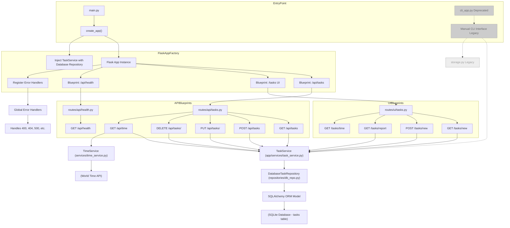

# S5 Architecture 

```mermaid
graph TD

%% ========== Entry Point ==========
subgraph EntryPoint
    A["main.py"] --> B["create_app()"]
    A2["cli_app.py Deprecated"] -.-> K["Manual CLI Interface Legacy"]
end

%% ========== App Factory ==========
subgraph FlaskAppFactory
    B --> C["Flask App Instance"]
    C --> D["Blueprint: /api/tasks"]
    C --> D2["Blueprint: /tasks UI"]
    C --> Eh["Blueprint: /api/health"]
    C --> E["Register Error Handlers"]
    B --> DI["Inject TaskService with Database Repository"]
end

%% ========== API Blueprints ==========
subgraph APIBlueprints
    D --> F["routes/api/tasks.py"]
    F --> F1["GET /api/tasks"]
    F --> F2["POST /api/tasks"]
    F --> F3["PUT /api/tasks/<id>"]
    F --> F4["DELETE /api/tasks/<id>"]
    F --> F5["GET /api/time"]
    Eh --> H1["routes/api/health.py"]
    H1 --> H2["GET /api/health"]
end

%% ========== UI Blueprints ==========
subgraph UIBlueprints
    D2 --> U["routes/ui/tasks.py"]
    U --> U1["GET /tasks/new"]
    U --> U2["POST /tasks/new"]
    U --> U3["GET /tasks/report"]
    U --> U4["GET /tasks/time"]
end

%% ========== Service Layer ==========
F1 & F2 & F3 & F4 & F5 & U1 & U2 & U3 --> S["TaskService (app/services/task_service.py)"]
S --> R["DatabaseTaskRepository (repositories/db_repo.py)"]

%% ========== Database Layer ==========
R --> ORM["SQLAlchemy ORM Model"]
ORM --> DB["(SQLite Database - tasks table)"]

%% ========== External API ==========
F5 --> EXT["TimeService (services/time_service.py)"]
EXT --> WorldTimeAPI["(World Time API)"]

%% ========== Error Handling ==========
E --> J["Global Error Handlers"]
J --> J1["Handles 400, 404, 500, etc."]

%% ========== Deprecated ==========
K -.-> S
K -.-> storage["storage.py Legacy"]

%% ========== Styles ==========
style A2 fill:#ccc,stroke:#999,color:#666
style K fill:#ccc,stroke:#999,color:#666
style storage fill:#eee,stroke:#999,color:#999

```