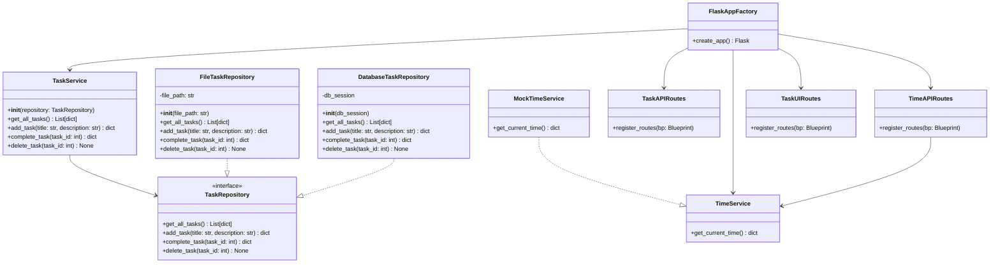

# S5 Class Diagram

## 🧩 **Sprint 4 Architectural Highlights**:

- The system now uses `DatabaseTaskRepository` with SQLAlchemy for persistence.
- `TaskService` is injected with a `TaskRepository` using **constructor-based DI** via the app factory.
- `TaskUIRoutes` provides form-based task creation with real-time validation.
- The CLI is now deprecated and fully replaced by the web UI.

---

## 🧩 **Sprint 5 Architectural Highlights**:

* The system now integrates `TimeService` for external API access to [World Time API](http://worldtimeapi.org), with support for mock injection during testing.
* `TimeAPIRoutes` is introduced as a new Flask Blueprint to register the `/api/time` endpoint, using dependency injection.
* `MockTimeService` is used in unit, integration, and Robot Framework acceptance tests to isolate time logic and ensure predictable outputs.
* All service classes (`TaskService`, `TimeService`) are injected via `FlaskAppFactory`, maintaining a clean separation of concerns.
* The architecture now supports **multi-service injection**, laying groundwork for extensibility (e.g., notifications, scheduling).
* Regression and CI testing is expanded to include time-based logic, automated via `pytest`, `requests`, and `Robot Framework`.

---