# Sprint 5 Planning

This final sprint emphasizes automated acceptance testing using Robot Framework and CI validation. In Spint 4 you used BDD for acceptance testing. , CI validation, and readiness for group continuation. 

You will validate previously implemented features using Robot Framework and ensure the application meets all documentation, coverage, and modularity standards. In addition, our test suite will be extended to test the implementation of an external API 


---

## 1. Sprint Goals

Expand test coverage to include Robot Framework acceptance tests and external API testing. Introduce UI time display, and confirm that all features refactored in Sprints 3–4 are validated via automated regression tests. This sprint completes core acceptance testing goals and finalizes support for external service integration.

---

## 2. 📦 What's New This Sprint

| Feature                           | Description                                                                |
| --------------------------------- | -------------------------------------------------------------------------- |
| 🌍 **External API Integration**   | Add support for [TimeAPI.io](https://timeapi.io/api/Time/current/zone?timeZone=UTC)timeZone=UTC`                    |
| 🧪 **Mock Testing**               | Use `unittest.mock` to isolate external service logic in unit tests        |
| 🤖 **Robot Framework UI Testing** | Introduce automated browser-based acceptance testing using Robot Framework |
| 💉 **Final DI Planning**          | (Optional) Advanced service injection strategies (RF022 - tutorial only)   |
| ⚙️ **CI Enhancements**            | Ensure API tests and Robot tests run or skip conditionally in CI           |
| 👥 **Group Project Readiness**    | Reinforce app modularity and prepare for shared collaboration              |


## 3. 🔍 Educational Context

This sprint introduces key real-world concepts:

* Working with 3rd-party APIs
* Creating injectable services for external integrations
* Using mocking to isolate external dependencies
* Expanding acceptance testing beyond BDD, Selenium/Playwright into Robot Framework
* Managing CI conditions for flaky or live-external testing
* Supporting multi-developer workflows via modularized code and testing (client, backend, API integration) in group settings

## 4. User Stories and Technical Tasks

| ID        | Title                              | Type          | Status         |
| --------- | ---------------------------------- | ------------- | -------------- |
| US031     | Show Current Time via External API | Functional    | 🔄 Done         |
| US035     | API Testing with requests          | Testing       | ✅ Done         |
| US036     | UI Form Validation                 | Functional    | ✅ Done         |
| US037     | Playwright UI Test (Add Task)      | Testing       | ✅ Done         |
| US038     | Robot Framework: Accept Test       | Testing       | ✅ Done         |
| **US039** | **View Current Time in Web UI**    | Functional    | 🔄 In Progress |
| RF015     | Add TimeService Layer              | Refactor      | ✅ Done         |
| RF016     | Inject TimeService into App        | Refactor      | ✅ Done         |
| RF017     | Add `/api/time` Endpoint           | Feature       | ✅ Done         |
| RF018     | Add Web UI Display for Time        | Feature       | 🔄 In Progress |
| RF019     | Mock External Time for Tests       | Testing Infra | ✅ Done         |
| RF020     | Add Robot Framework CI Integration | DevOps        | ✅ Done         |
| RF021     | Regression Suite for All Endpoints | Testing       | ✅ Done         |


## 5. ✅ Definition of Done (DoD)

Each story or task is complete when:

* Code is committed and pushed with passing CI tests.
* Feature is tested with unit/integration or UI test as appropriate.
* Feature or endpoint is documented in the updated API Reference.
* If UI: visible, user-facing behavior is confirmed via screenshot or demo.
* If API: response is verified via automated test or Postman.
* Coverage > 90% maintained or improved.

---
## 6. 📌 Sprint-Level Completion Criteria

* [x] `/api/time` endpoint implemented with fallback + error handling
* [x] Web UI displays current time (new block in Task Summary)
* [x] Robot Framework test executes in CI and passes
* [x] Full regression tests executed and pass
* [x] Mock services used in tests for isolation
* [x] Sprint 5 test plan and test cases submitted
* [x] API Reference updated with `/api/time`
* [x] Test logs, screenshots, or coverage proof uploaded
* [x] CI pipeline for Robot Framework integrated in `.github/workflows/python-app.yml`

## 🧱 Architecture Highlights


## API Highlights

```mermaid
flowchart TD
    A[Postman / Browser / CI Tool / Robot Framework] --> B[Flask App]

    %% ========== API (JSON) ==========
    subgraph API_Endpoints
        B --> C1["GET /api/health"] --> R1["200 → { status: 'ok' }"]
        B --> C2["GET /api/tasks"] --> R2["200 → [ Task, ... ]"]
        B --> C3["POST /api/tasks"] --> R3["201 → New Task JSON, 400 on invalid"]
        B --> C4["PUT /api/tasks/<id>"] --> R4["200 → Updated Task JSON, 400/404 on error"]
        B --> C5["DELETE /api/tasks/<id>"] --> R5["200 → {message}, 404 if not found"]
        B --> C6["POST /api/tasks/reset (test-only)"] --> R6["204 → No Content"]
        B --> C7["GET /api/time (External API)"] --> R7["200 → Time JSON, error if failed"]
    end

    %% ========== UI (HTML Forms) ==========
    subgraph UI_HTML
        B --> U1["GET /tasks/new → Task Form"]
        B --> U2["POST /tasks/new → Create Task (validates)"]
        B --> U3["GET /tasks/report → Summary Page"]
    end

    %% ========== Service & Persistence ==========
    B --> S["TaskService (Dependency Injection)"]
    S --> RP["DatabaseTaskRepository"]
    RP --> DB["SQLite DB (via SQLAlchemy)"]
```


### 🆕 US031 – Show Current Time via External API

> As a user, I want to view the current time (UTC or local) so that I can track when tasks were created or updated.

* **API**: `GET /api/time`
* **Acceptance Criteria**:

  * Returns JSON with current time from external API (e.g., `{"datetime": "2025-08-05T18:42:00Z"}`)
  * Can handle API failures gracefully (returns fallback or error message)
* **Test Coverage**
  * Mocked unit tests
  * Real API test (toggled in CI)
  * Route and response validation

### 📋 Test Cases

* TC-US031-001: Valid API response
* TC-US031-002: API error fallback
* TC-US031-003: Unit test with mock
* TC-US031-004: Real API test (optional via toggle)
* **TC-RF-US031-001**: Acceptance test using Robot Framework
* TC-US039-001: Playwright: Add Time to UI
* TC-US039-002: Robot: Add Time to UI

### 📊 Robot Framework Acceptance Test Coverage

This sprint introduces a formal acceptance test suite using Robot Framework to validate end-to-end behavior. These tests do not replace existing Selenium/Playwright/BDD tests but augment them for stakeholder-level scenarios.


| ✅ User Stories Covered         |
| ------------------------------ |
| US002 – Add Task               |
| US003 – View Tasks             |
| US005 – Mark Complete          |
| US007 – Delete Task            |
| US012 – Add Task via Web UI    |
| US015 – Error Handling         |
| US026 – View Task List (UI)    |
| US027 – View Task Report       |
| US031 - Show Current Time via External API |
| US036 – Server-side Validation |


Robot tests include page navigation, form submission, validation, and result checks.

---

## 6. 🔧 Suggested Folder Structure Changes

```plaintext
app/
├── routes/
│   └── time.py                # New Blueprint for /api/time
├── services/
│   └── time_service.py        # TimeService class (API wrapper)

tests/
├── services/
│   └── test_time_service.py   # Mock-based unit tests
├── integration/
│   └── test_time_api.py       # Optional real external call test
├── acceptance/
│   └── robot/                 # Robot Framework suite and resources

.github/workflows/
└── python-app.yml             # Add Robot + external API coverage support
```

---

## 7. ⟳ Refactors Introduced in Sprint 5

| Refactor ID | Description                                                        |
| ----------- | ------------------------------------------------------------------ |
| **RF015**   | Add `TimeService` for API calls using `requests`                   |
| **RF016**   | Inject `TimeService` into Flask app via `__init__.py`              |
| **RF017**   | Add `GET /api/time` endpoint in new `routes/time.py`               |
| **RF018**   | Mock requests in unit tests for API isolation                      |
| **RF019**   | Add environment toggle or skip logic for flaky real API test in CI |
| **RF020**   | Add Robot Framework test for `/api/time`                           |
| **RF021**   | Add Robot Framework test suite for existing user stories           |
| **RF022**   | Finalize Dependency Injection (Optional / Tutorial Only)           |


## 🧪 Test Coverage Strategy

| Layer      | Tool                   | Focus Area                       |
| ---------- | ---------------------- | -------------------------------- |
| Unit Tests | Pytest                 | Service logic + validation       |
| API Tests  | `requests`             | JSON endpoints                   |
| Manual API | Postman / curl         | Spot-check new endpoints         |
| UI Tests   | Selenium, Playwright   | Add Task, View Task Report       |
| Acceptance | Robot Framework        | `/tasks/report` + time display   |
| Mocking    | `mock_time_service.py` | All TimeService unit/integration |
| CI         | GitHub Actions         | Full regression suite            |

---
### 🧠 Notes

* MockTimeService is injected during Playwright/Robot/UI test setup to ensure consistent time string
* TimeService fallback to real external API verified separately
* Use `conftest.py` fixture to configure mock for UI routes
* Future enhancement: Allow toggling between local and external time service in config

## 9. Technical Design & Architecture

* **Refactor** remaining procedural code into reusable functions or classes
* **Finalize DI** structure for testable services
  * Refactor application so that key dependencies (like storage, services, or logic classes) are injected rather than hardcoded.
* **Ensure UI routes** are integrated with backend functionality
* **Robot Tests** simulate real user behavior

---

## 10. Risk Management

* **Tool Confusion**: Multiple testing tools may confuse beginners
  *Mitigation:* Focus on Robot Framework, provide templates

* **Test Failures**: Integration test regressions may appear
  *Mitigation:* Run early and often, fix in priority order

* **CI Inconsistency**: Robot tests might be flaky
  *Mitigation:* Stabilize selectors, add waits/assertions, rerun as needed

---

## 11. Documentation Plan

* **README**: Final update with all features and testing tools
* **API Documentation**: Ensure all routes are described
* **UI Documentation**: Annotated screenshots of key pages
* **Test Plan**: Final plan describing all test types and coverage tools
* **Test Cases**: Robot test cases formatted and documented
* **Test Report**: Final run report with screenshots and results summary

---

## 12. Collaboration & Communication

* GitHub Project Board: Sprint 5 column with test/refactor tasks
* GitHub Issues: One per acceptance test with tag `robot`
* Pull Requests: Required for Robot test addition and final test refactors

