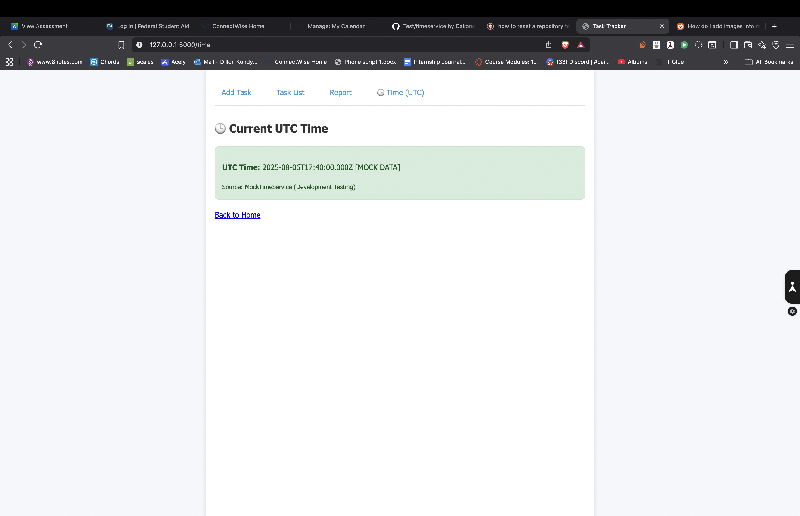

d

I could not find a single way to put an image directly in an md file, the closest I could get was having references to the actual images in the md file. and I have no clue why you wanted me to do this instead of just leaving it in the folder